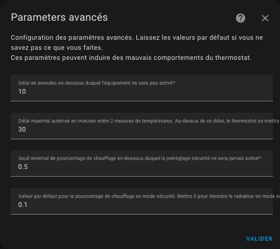

# Pokročilá konfigurace

- [Pokročilá konfigurace](#pokročilá-konfigurace)
  - [Pokročilá nastavení](#pokročilá-nastavení)
    - [Minimální doba aktivace](#minimální-doba-aktivace)
    - [Bezpečnostní režim](#bezpečnostní-režim)

Tato nastavení dolaďují provoz termostatu, zejména bezpečnostní mechanismus _VTherm_. Chybějící teplotní senzory (místnosti nebo venkovní) mohou představovat riziko pro váš domov. Pokud se například teplotní senzor zasekne na 10°C, _VTherm_ typu `over_climate` nebo `over_valve` bude nařizovat maximální vytápění podkladových zařízení, což by mohlo vést k přehřátí místnosti nebo dokonce k poškození majetku, v nejhorším případě k požáru.

Aby se tomu zabránilo, _VTherm_ zajišťuje, že teploměry pravidelně hlásí hodnoty. Pokud to nedělají, _VTherm_ přepne do speciálního režimu nazývaného Bezpečnostní režim. Tento režim zajišťuje minimální vytápění pro prevenci opačného rizika: úplně nevytápěného domova uprostřed zimy.

Výzva spočívá v tom, že některé teploměry—zejména ty na baterie—posílají aktualizace teploty pouze když se hodnota změní. Je zcela možné nedostávat teplotní aktualizace hodiny, aniž by teploměr selhal. Parametry níže umožňují jemné doladění prahových hodnot pro aktivaci Bezpečnostního režimu.

Pokud má váš teploměr atribut `last seen` indikující čas posledního kontaktu, můžete jej specifikovat v hlavních atributech _VTherm_ pro výrazné snížení falešných aktivací Bezpečnostního režimu. Viz [konfigurace](base-attributes.md#choosing-base-attributes) a [řešení problémů](troubleshooting.md#why-does-my-versatile-thermostat-switch-to-safety-mode).

Pro _VTherm_ typu `over_climate`, které se samo-regulují, je Bezpečnostní režim deaktivován. V tomto případě není žádné nebezpečí, pouze riziko nesprávné teploty.

## Pokročilá nastavení

Formulář pokročilé konfigurace vypadá takto:



### Minimální doba aktivace

První prodleva (`minimal_activation_delay_sec`) v sekundách je minimální přijatelná doba pro zapnutí vytápění. Pokud je vypočítaná doba aktivace kratší než tato hodnota, vytápění zůstane vypnuté. Tento parametr se vztahuje pouze na _VTherm_ s cyklickým spouštěním `over_switch`. Pokud je doba aktivace příliš krátká, rychlé přepínání neumožní zařízení správně se zahřát.

### Minimální doba deaktivace

Prodleva (`minimal_deactivation_delay_sec`) v sekundách je minimální přijatelná doba pro vypnutí vytápění. Pokud je vypočítaná doba deaktivace kratší než tato hodnota, vytápění zůstane zapnuté.

### Bezpečnostní režim

Druhá prodleva (`safety_delay_min`) je maximální čas mezi dvěma teplotními měřeními předtím, než _VTherm_ přepne do Bezpečnostního režimu.

Třetí parametr (`safety_min_on_percent`) je minimální `on_percent`, pod kterým nebude Bezpečnostní režim aktivován. Toto nastavení zabraňuje aktivaci Bezpečnostního režimu, pokud ovládaný radiátor dostatečně netopí. V tomto případě není žádné fyzické riziko pro domov, pouze riziko přehřátí nebo nedotápění.
Nastavení tohoto parametru na `0.00` spustí Bezpečnostní režim bez ohledu na poslední nastavení topení, zatímco `1.00` nikdy nespustí Bezpečnostní režim (efektivně funkci deaktivuje). To může být užitečné pro přizpůsobení bezpečnostního mechanismu vašim specifickým potřebám.

Čtvrtý parametr (`safety_default_on_percent`) definuje `on_percent` používané, když termostat přepne do režimu `security`. Nastavení na `0` vypne termostat v Bezpečnostním režimu, zatímco nastavení na hodnotu jako `0.2` (20%) zajišťuje pokračování určitého vytápění, čímž se zabrání úplně zmrzlému domovu v případě selhání teploměru.

Je možné deaktivovat Bezpečnostní režim spouštěný chybějícími daty z venkovního teploměru. Protože venkovní teploměr má obvykle menší dopad na regulaci (závisí na vaší konfiguraci), nemusí být kritické, pokud není dostupný. Pro to přidejte následující řádky do vašeho `configuration.yaml`:

```yaml
versatile_thermostat:
...
    safety_mode:
        check_outdoor_sensor: false
```

Ve výchozím nastavení může venkovní teploměr spustit Bezpečnostní režim, pokud přestane posílat data. Pamatujte, že Home Assistant musí být restartován, aby se tyto změny projevily. Toto nastavení se vztahuje na všechny _VTherm_ sdílející venkovní teploměr.

>  _*Poznámky*_
> 1. Když teplotní senzor obnoví hlášení, preset bude obnoven na svou předchozí hodnotu.
> 2. Jsou vyžadovány dva teplotní zdroje: vnitřní a venkovní teploty. Oba musí hlásit hodnoty, jinak termostat přepne do presetem "security".
> 3. Je dostupná akce pro úpravu tří bezpečnostních parametrů. To může pomoci přizpůsobit Bezpečnostní režim vašim potřebám.
> 4. Pro normální použití by `safety_default_on_percent` mělo být nižší než `safety_min_on_percent`.
> 5. Pokud používáte UI kartu Versatile Thermostat (viz [zde](additions.md#better-with-the-versatile-thermostat-ui-card)), _VTherm_ v Bezpečnostním režimu je označen šedým překrytím zobrazujícím vadný teploměr a čas od jeho poslední aktualizace hodnoty: .
