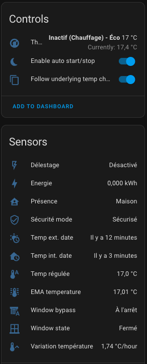
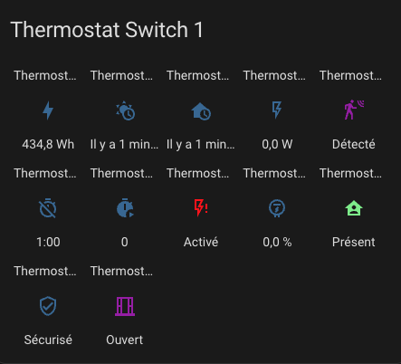
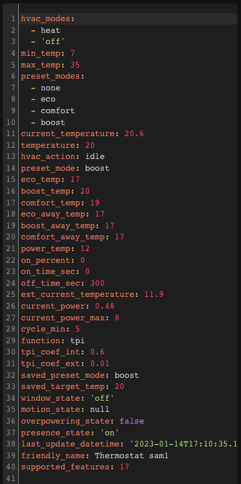

# Referenční dokumentace

- [Referenční dokumentace](#referenční-dokumentace)
  - [Přehled parametrů](#přehled-parametrů)
- [Konfigurace Expert módu](#konfigurace-expert-módu)
  - [Parametry samoregulace v Expert módu](#parametry-samoregulace-v-expert-módu)
  - [Vypnutí kontroly venkovního senzoru v bezpečnostním režimu](#vypnutí-kontroly-venkovního-senzoru-v-bezpečnostním-režimu)
  - [Limit maximálního topného výkonu](#limit-maximálního-topného-výkonu)
  - [Parametry automatické detekce otevřeného okna](#parametry-automatické-detekce-otevřeného-okna)
  - [Retence log souborů (Log Buffer)](#retence-log-souborů-log-buffer)
- [Senzory](#senzory)
- [Akce (služby)](#akce-služby)
  - [Vynucení přítomnosti/obsazení](#vynucení-přítomnostiobsazení)
  - [Úprava bezpečnostních nastavení](#úprava-bezpečnostních-nastavení)
  - [ByPass Window Check](#bypass-window-check)
  - [Služby zamknutí / odemknutí](#služby-zamknutí--odemknutí)
  - [Změna TPI parametrů](#změna-tpi-parametrů)
  - [Timed Preset](#timed-preset)
- [Události](#události)
- [Vlastní atributy](#vlastní-atributy)
  - [Pro _VTherm_](#pro-vtherm)
  - [Pro centrální konfiguraci](#pro-centrální-konfiguraci)
- [Stavové zprávy](#stavové-zprávy)

## Přehled parametrů

| Parametr                                  | Popisek                                                    | "over switch" | "over climate"      | "over valve" | "central configuration" |
| ----------------------------------------- | ---------------------------------------------------------- | ------------- | ------------------- | ------------ | ----------------------- |
| ``name``                                  | Název                                                      | X             | X                   | X            | -                       |
| ``thermostat_type``                       | Typ termostatu                                             | X             | X                   | X            | -                       |
| ``temperature_sensor_entity_id``          | ID entity teplotního senzoru                               | X             | X (auto-regulation) | X            | -                       |
| ``external_temperature_sensor_entity_id`` | ID entity externího teplotního senzoru                     | X             | X (auto-regulation) | X            | X                       |
| ``cycle_min``                             | Délka cyklu (minuty)                                       | X             | X                   | X            | -                       |
| ``temp_min``                              | Minimální povolená teplota                                 | X             | X                   | X            | X                       |
| ``temp_max``                              | Maximální povolená teplota                                 | X             | X                   | X            | X                       |
| ``device_power``                          | Výkon zařízení                                             | X             | X                   | X            | -                       |
| ``use_central_mode``                      | Povolit centralizované řízení                              | X             | X                   | X            | -                       |
| ``use_window_feature``                    | S detekcí okna                                             | X             | X                   | X            | -                       |
| ``use_motion_feature``                    | S detekcí pohybu                                           | X             | X                   | X            | -                       |
| ``use_power_feature``                     | Se správou výkonu                                          | X             | X                   | X            | -                       |
| ``use_presence_feature``                  | S detekcí přítomnosti                                      | X             | X                   | X            | -                       |
| ``heater_entity1_id``                     | 1. topné zařízení                                          | X             | -                   | -            | -                       |
| ``heater_entity2_id``                     | 2. topné zařízení                                          | X             | -                   | -            | -                       |
| ``heater_entity3_id``                     | 3. topné zařízení                                          | X             | -                   | -            | -                       |
| ``heater_entity4_id``                     | 4. topné zařízení                                          | X             | -                   | -            | -                       |
| ``heater_keep_alive``                     | Interval obnovy spínače                                    | X             | -                   | -            | -                       |
| ``proportional_function``                 | Algoritmus                                                 | X             | -                   | -            | -                       |
| ``climate_entity1_id``                    | Podřízený termostat                                        | -             | X                   | -            | -                       |
| ``climate_entity2_id``                    | 2. podřízený termostat                                     | -             | X                   | -            | -                       |
| ``climate_entity3_id``                    | 3. podřízený termostat                                     | -             | X                   | -            | -                       |
| ``climate_entity4_id``                    | 4. podřízený termostat                                     | -             | X                   | -            | -                       |
| ``valve_entity1_id``                      | Podřízený ventil                                           | -             | -                   | X            | -                       |
| ``valve_entity2_id``                      | 2. podřízený ventil                                        | -             | -                   | X            | -                       |
| ``valve_entity3_id``                      | 3. podřízený ventil                                        | -             | -                   | X            | -                       |
| ``valve_entity4_id``                      | 4. podřízený ventil                                        | -             | -                   | X            | -                       |
| ``ac_mode``                               | Použití klimatizace (AC)?                                  | X             | X                   | X            | -                       |
| ``tpi_coef_int``                          | Koeficient pro rozdíl vnitřní teploty                      | X             | -                   | X            | X                       |
| ``tpi_coef_ext``                          | Koeficient pro rozdíl venkovní teploty                     | X             | -                   | X            | X                       |
| ``frost_temp``                            | Teplota presetu Frost                                      | X             | X                   | X            | X                       |
| ``window_sensor_entity_id``               | Senzor okna (ID entity)                                    | X             | X                   | X            | -                       |
| ``window_delay``                          | Zpoždění před vypnutím (sekundy)                           | X             | X                   | X            | X                       |
| ``window_auto_open_threshold``            | Vysoký práh poklesu pro automatickou detekci (°/min)       | X             | X                   | X            | X                       |
| ``window_auto_close_threshold``           | Nízký práh poklesu pro automatickou detekci zavření (°/min)| X             | X                   | X            | X                       |
| ``window_auto_max_duration``              | Max. délka automatického vypnutí (minuty)                  | X             | X                   | X            | X                       |
| ``motion_sensor_entity_id``               | ID entity senzoru pohybu                                   | X             | X                   | X            | -                       |
| ``motion_delay``                          | Zpoždění, než je pohyb považován za aktivní (sekundy)      | X             | X                   | X            | -                       |
| ``motion_off_delay``                      | Zpoždění, než je považován konec pohybu (sekundy)          | X             | X                   | X            | X                       |
| ``motion_preset``                         | Preset, který se použije při detekci pohybu                | X             | X                   | X            | X                       |
| ``no_motion_preset``                      | Preset, který se použije při absenci pohybu                | X             | X                   | X            | X                       |
| ``power_sensor_entity_id``                | Senzor celkového výkonu (ID entity)                        | X             | X                   | X            | X                       |
| ``max_power_sensor_entity_id``            | Senzor maximálního výkonu (ID entity)                      | X             | X                   | X            | X                       |
| ``power_temp``                            | Teplota během odlehčení zátěže                             | X             | X                   | X            | X                       |
| ``presence_sensor_entity_id``             | ID entity senzoru přítomnosti (true, pokud je někdo doma)  | X             | X                   | X            | -                       |
| ``minimal_activation_delay``              | Minimální zpoždění aktivace                                | X             | -                   | -            | X                       |
| ``minimal_deactivation_delay``            | Minimální zpoždění deaktivace                              | X             | -                   | -            | X                       |
| ``safety_delay_min``                      | Max. prodleva mezi dvěma měřeními teploty                 | X             | -                   | X            | X                       |
| ``safety_min_on_percent``                 | Min. procento výkonu pro vstup do bezpečnostního režimu    | X             | -                   | X            | X                       |
| ``auto_regulation_mode``                  | Režim auto-regulace                                        | -             | X                   | -            | -                       |
| ``auto_regulation_dtemp``                 | Práh auto-regulace                                         | -             | X                   | -            | -                       |
| ``auto_regulation_period_min``            | Minimální perioda auto-regulace                            | -             | X                   | -            | -                       |
| ``inverse_switch_command``                | Invertovat příkaz spínače (pro spínače s pilotním vodičem) | X             | -                   | -            | -                       |
| ``auto_fan_mode``                         | Automatický režim ventilátoru                              | -             | X                   | -            | -                       |
| ``auto_regulation_use_device_temp``       | Použít interní teplotu podřízeného zařízení                | -             | X                   | -            | -                       |
| ``use_central_boiler_feature``            | Přidat ovládání centrálního kotle                          | -             | -                   | -            | X                       |
| ``central_boiler_activation_service``     | Služba pro aktivaci kotle                                  | -             | -                   | -            | X                       |
| ``central_boiler_deactivation_service``   | Služba pro deaktivaci kotle                                | -             | -                   | -            | X                       |
| ``central_boiler_activation_delay_sec``   | Zpoždění aktivace (sekundy)                                | -             | -                   | -            | X                       |
| ``used_by_controls_central_boiler``       | Indikuje, zda VTherm řídí centrální kotel                  | X             | X                   | X            | -                       |
| ``use_auto_start_stop_feature``           | Indikuje, zda je zapnutá funkce auto start/stop            | -             | X                   | -            | -                       |
| ``auto_start_stop_level``                 | Úroveň detekce pro auto start/stop                         | -             | X                   | -            | -                       |

# Konfigurace Expert módu

Versatile Thermostat umožňuje nastavovat pokročilé parametry přímo v souboru `configuration.yaml`. Tyto parametry jsou určené pro pokročilé uživatele a dávají jemnější kontrolu nad chováním termostatu.

## Parametry samoregulace v Expert módu

Když _VTherm_ typu `over_climate` používá pro samoregulaci režim **Expert**, můžete regulační parametry definovat přímo v `configuration.yaml`. Díky tomu lze velmi přesně doladit regulační chování.

Pro použití této funkce přidejte do `configuration.yaml` následující řádky:

```yaml
versatile_thermostat:
  auto_regulation_expert:
    kp: 0.6
    ki: 0.1
    k_ext: 0.0
    offset_max: 10
    accumulated_error_threshold: 80
    overheat_protection: true
```

Parametry jsou následující:

| Parametr | Popis | Typ | Příklad |
| --- | --- | --- | --- |
| `kp` | Proporcionální faktor aplikovaný na surovou teplotní chybu (rozdíl mezi cílovou a aktuální teplotou) | Float | 0.6 |
| `ki` | Integrální faktor aplikovaný na akumulaci chyby v čase | Float | 0.1 |
| `k_ext` | Faktor aplikovaný na rozdíl mezi vnitřní a venkovní teplotou. Umožňuje kompenzovat vnější vlivy | Float | 0.0 |
| `offset_max` | Maximální korekce (offset), kterou může regulace použít na setpoint | Float | 10 |
| `accumulated_error_threshold` | Maximální práh akumulace chyby. Brání nekonečnému narůstání chyby | Float | 80 |
| `overheat_protection` | Zapíná ochranu proti přetopení omezením kladných korekcí (volitelné) | Boolean | true |

>  _*Důležitá poznámka*_
>
> - Tyto parametry platí pro **všechny _VTherm_ v Expert módu** v systému. Nelze mít rozdílné konfigurace pro jednotlivé termostaty.
> - Aby se změny projevily, je potřeba **restartovat Home Assistant** (nebo znovu načíst integraci Versatile Thermostat v Developer Tools).
> - Příklady přednastavených konfigurací najdete v [dokumentaci samoregulace](self-regulation.md).

## Vypnutí kontroly venkovního senzoru v bezpečnostním režimu

Ve výchozím stavu bezpečnostní režim kontroluje, zda **senzor venkovní teploty** pravidelně posílá data. Pokud ale venkovní senzor nemáte, nebo není pro vaši instalaci důležitý, můžete tuto kontrolu vypnout.

Uděláte to přidáním následujících řádků do `configuration.yaml`:

```yaml
versatile_thermostat:
  safety_mode:
    check_outdoor_sensor: false
```

| Parametr | Popis | Typ | Výchozí hodnota |
| --- | --- | --- | --- |
| `check_outdoor_sensor` | Pokud je `true`, absence dat z venkovního senzoru aktivuje bezpečnostní režim. Pokud je `false`, kontroluje se jen vnitřní senzor | Boolean | true |

>  _*Důležitá poznámka*_
>
> - Tato úprava se vztahuje na **všechny _VTherm_** v systému
> - Ovlivňuje detekci u všech termostatů současně
> - Aby se změny projevily, je potřeba **restartovat Home Assistant**

## Limit maximálního topného výkonu

Parametr `max_on_percent` umožňuje globálně omezit maximální topný výkon celé instalace. Hodí se například při elektrických omezeních nebo pro řízení zátěže systému.

Tento limit nastavíte přidáním následujícího řádku do `configuration.yaml`:

```yaml
versatile_thermostat:
  max_on_percent: 0.9
```

| Parametr | Popis | Typ | Rozsah | Výchozí hodnota |
| --- | --- | --- | --- | --- |
| `max_on_percent` | Maximální povolené procento topného výkonu. `1.0` = 100 % výkonu, `0.9` = 90 % atd. | Float | 0.0 až 1.0 | 1.0 |

**Příklady použití**:
- `0.8`: omezení topení na 80 % kapacity
- `0.5`: omezení na 50 % (užitečné při elektrickém přetížení)
- `1.0`: bez omezení (výchozí chování)

>  _*Důležitá poznámka*_
>
> - Toto omezení platí pro **všechny _VTherm_** v systému
> - Aplikuje se okamžitě bez restartu
> - Ovlivňuje maximální výkon vypočítaný v každém cyklu

## Parametry automatické detekce otevřeného okna

Při použití automatické detekce otevřeného okna (na základě poklesu teploty) můžete jemně nastavit parametry vyhlazování teploty pro lepší detekci.

Pro konfiguraci těchto parametrů přidejte do `configuration.yaml` následující řádky:

```yaml
versatile_thermostat:
  short_ema_params:
    max_alpha: 0.5
    halflife_sec: 300
    precision: 2
```

| Parametr | Popis | Typ | Rozsah | Výchozí hodnota |
| --- | --- | --- | --- | --- |
| `max_alpha` | Maximální vyhlazovací faktor (alpha) pro exponenciální klouzavý průměr. Ovlivňuje citlivost na rychlé změny teploty | Float | 0.0 až 1.0 | 0.5 |
| `halflife_sec` | Poločas v sekundách pro výpočet klouzavého průměru. Určuje, jak rychle staré hodnoty ztrácejí váhu | Integer | > 0 | 300 |
| `precision` | Počet desetinných míst zachovaných při výpočtu klouzavého průměru | Integer | > 0 | 2 |

**Význam parametrů**:
- **`max_alpha`**: vyšší hodnota dělá detekci reaktivnější na náhlé změny (rychlejší detekce, ale vyšší citlivost na falešně pozitivní stavy)
- **`halflife_sec`**: kratší doba znamená rychlejší zapomínání starších hodnot (rychlejší detekce)
- **`precision`**: řídí zaokrouhlování výpočtu (většinou není potřeba měnit)

>  _*Tyto parametry jsou citlivé*_
>
> - Tyto parametry ovlivňují automatickou detekci otevřeného okna
> - Platí pro **všechny _VTherm_** v systému
> - Měňte je jen pokud máte problémy s detekcí (falešné poplachy nebo nedetekované otevření)
> - Podrobnosti najdete v [sekci řešení problémů](troubleshooting.md)

## Retence log souborů (Log Buffer)

Versatile Thermostat udržuje interní logy pro řešení problémů. Můžete nastavit, jak dlouho se mají uchovávat.

Pro nastavení doby uchování přidejte do `configuration.yaml` následující řádek:

```yaml
versatile_thermostat:
  log_buffer_max_age_hours: 24
```

| Parametr | Popis | Typ | Rozsah | Výchozí hodnota |
| --- | --- | --- | --- | --- |
| `log_buffer_max_age_hours` | Maximální doba uchování logů v hodinách. Starší logy budou automaticky mazány | Integer | > 0 | 24 |

**Příklady použití**:
- `12`: uchová logy za posledních 12 hodin
- `24`: uchová logy za 24 hodin (1 den)
- `72`: uchová logy za 72 hodin (3 dny) pro delší troubleshooting

>  _*Správa paměti*_
>
> - Delší doba uchování spotřebovává více paměti
> - Toto nastavení ovlivňuje **všechny _VTherm_** v systému
> - Logy jsou užitečné při řešení problémů přes endpoint pro stažení logů

# Senzory

Termostat poskytuje senzory pro vizualizaci alertů a interního stavu termostatu. Najdete je mezi entitami zařízení přidruženého k termostatu:



V pořadí jde o:
1. hlavní entitu ``climate`` pro ovládání termostatu,
2. entitu umožňující funkci auto-start/stop,
3. entitu, která umožňuje _VTherm_ sledovat změny na podřízeném zařízení,
4. energii spotřebovanou termostatem (hodnota se průběžně navyšuje),
5. čas přijetí poslední externí teploty,
6. čas přijetí poslední interní teploty,
7. průměrný výkon zařízení během cyklu (jen pro TPI),
8. čas strávený ve stavu off během cyklu (jen TPI),
9. čas strávený ve stavu on během cyklu (jen TPI),
10. stav odlehčení zátěže,
11. procento výkonu během cyklu (jen TPI),
12. stav přítomnosti (pokud je nakonfigurovaná správa přítomnosti),
13. stav bezpečnosti,
14. stav okna (pokud je nakonfigurovaná správa oken),
15. stav pohybu (pokud je nakonfigurovaná správa pohybu),
16. procento otevření ventilu (pro typ `over_valve`),

Přítomnost těchto entit závisí na tom, zda je příslušná funkce zapnutá.

Pro obarvení senzorů přidejte do `configuration.yaml` následující řádky a případně je upravte:

```yaml
frontend:
  themes:
    versatile_thermostat_theme:
      state-binary_sensor-safety-on-color: "#FF0B0B"
      state-binary_sensor-power-on-color: "#FF0B0B"
      state-binary_sensor-window-on-color: "rgb(156, 39, 176)"
      state-binary_sensor-motion-on-color: "rgb(156, 39, 176)"
      state-binary_sensor-presence-on-color: "lightgreen"
      state-binary_sensor-running-on-color: "orange"
```

a v konfiguraci panelu vyberte téma ```versatile_thermostat_theme```. Výsledek bude vypadat podobně:



# Akce (služby)

Tato vlastní implementace nabízí specifické akce (služby), které usnadňují integraci s dalšími komponentami Home Assistant.

## Vynucení přítomnosti/obsazení
Tato služba umožňuje vynutit stav přítomnosti nezávisle na senzoru přítomnosti. To je užitečné, pokud chcete přítomnost řídit službou místo senzoru. Například můžete alarmem vynutit nepřítomnost při jeho zapnutí.

Kód pro volání služby:

```yaml
service: versatile_thermostat.set_presence
data:
    presence: "off"
target:
    entity_id: climate.my_thermostat
```

## Úprava bezpečnostních nastavení
Tato služba umožňuje dynamicky měnit bezpečnostní nastavení popsaná zde [Pokročilá konfigurace](#advanced-configuration).
Pokud je termostat v režimu ``security``, nová nastavení se aplikují okamžitě.

Pro změnu bezpečnostních nastavení použijte:
```yaml
service: versatile_thermostat.set_safety
data:
    min_on_percent: "0.5"
    default_on_percent: "0.1"
    delay_min: 60
target:
    entity_id: climate.my_thermostat
```

## ByPass Window Check
Tato služba umožňuje zapnout nebo vypnout bypass kontroly okna.
Díky tomu může termostat pokračovat v topení, i když je detekováno otevřené okno.
Pokud nastavíte ``true``, změny stavu okna už nebudou termostat ovlivňovat. Při hodnotě ``false`` bude termostat deaktivován, pokud je okno stále otevřené.

Pro změnu bypassu použijte:
```yaml
service: versatile_thermostat.set_window_bypass
data:
    bypass: true
target:
    entity_id: climate.my_thermostat
```

## Služby zamknutí / odemknutí

- `versatile_thermostat.lock` - Zamkne termostat a zabrání změnám konfigurace
- `versatile_thermostat.unlock` - Odemkne termostat a povolí změny konfigurace

Podrobnosti najdete v [Lock Feature](feature-lock.md).
## Změna TPI parametrů
Všechny TPI parametry konfigurovatelné zde lze změnit službou. Tyto změny jsou trvalé i po restartu. Aplikují se okamžitě a po změně parametrů se termostat ihned aktualizuje.

Každý parametr je volitelný. Pokud není uveden, zachová se jeho aktuální hodnota.

Pro změnu TPI parametrů použijte:

```
action: versatile_thermostat.set_tpi_parameters
data:
  tpi_coef_int: 0.5
  tpi_coef_ext: 0.01
  minimal_activation_delay: 10
  minimal_deactivation_delay: 10
  tpi_threshold_low: -2
  tpi_threshold_high: 5
target:
  entity_id: climate.sonoff_trvzb
```

## Timed Preset
Tyto služby umožňují dočasně vynutit preset na termostatu po určenou dobu. Detaily viz [Timed Preset](feature-timed-preset.md).

Aktivace timed presetu:
```yaml
service: versatile_thermostat.set_timed_preset
data:
  preset: "boost"
  duration_minutes: 30
target:
  entity_id: climate.my_thermostat
```

Zrušení timed presetu před vypršením:
```yaml
service: versatile_thermostat.cancel_timed_preset
target:
  entity_id: climate.my_thermostat
```

# Události
Klíčové události termostatu jsou oznamovány přes message bus.
Oznamují se tyto události:

- ``versatile_thermostat_safety_event``: termostat vstoupí nebo opustí preset ``security``
- ``versatile_thermostat_power_event``: termostat vstoupí nebo opustí preset ``power``
- ``versatile_thermostat_temperature_event``: jedno nebo obě teplotní měření termostatu nebylo aktualizováno déle než `safety_delay_min`` minut
- ``versatile_thermostat_hvac_mode_event``: termostat se zapne nebo vypne. Tato událost se vysílá i při startu termostatu
- ``versatile_thermostat_preset_event``: na termostatu byl vybrán nový preset. Tato událost se vysílá i při startu termostatu
- ``versatile_thermostat_central_boiler_event``: událost indikující změnu stavu kotle
- ``versatile_thermostat_auto_start_stop_event``: událost indikující zastavení nebo restart provedený funkcí auto-start/stop
- ``versatile_thermostat_timed_preset_event``: událost indikující aktivaci nebo deaktivaci timed presetu

Pokud jste postupovali podle dokumentace, při přechodu termostatu do bezpečnostního režimu se spustí 3 události:
1. ``versatile_thermostat_temperature_event`` pro informaci, že některý teploměr neodpovídá,
2. ``versatile_thermostat_preset_event`` pro informaci o přepnutí na preset ``security``,
3. ``versatile_thermostat_hvac_mode_event`` pro informaci o možném vypnutí termostatu

Každá událost nese klíčové hodnoty (teploty, aktuální preset, aktuální výkon, ...) i stavy termostatu.

Tyto události lze snadno zachytit v automatizaci, například pro notifikace uživatelům.

# Vlastní atributy

Pro ladění algoritmu máte přes vyhrazené atributy přístup k celému kontextu, který termostat vidí a počítá. Tyto atributy můžete zobrazit (a použít) v HA v části "Developer Tools / States". Po otevření termostatu uvidíte něco jako:



## Pro _VTherm_
Vlastní atributy jsou následující:

| Atribut                                         | Význam                                                                                                                                                                                                        |
| ----------------------------------------------- | ------------------------------------------------------------------------------------------------------------------------------------------------------------------------------------------------------------- |
| ``hvac_modes``                                  | Seznam režimů podporovaných termostatem                                                                                                                                                                       |
| ``temp_min``                                    | Minimální teplota                                                                                                                                                                                              |
| ``temp_max``                                    | Maximální teplota                                                                                                                                                                                              |
| ``target_temp_step``.                           | Krok cílové teploty                                                                                                                                                                                            |
| ``preset_modes``                                | Viditelné presety pro tento termostat. Skryté presety se zde nezobrazují                                                                                                                                      |
| ``current_temperature``                         | Aktuální teplota podle senzoru                                                                                                                                                                                 |
| ``temperature``                                 | Cílová teplota                                                                                                                                                                                                 |
| ``hvac_action``                                 | Akce, kterou právě zařízení provádí. Může být idle, heating, cooling                                                                                                                                           |
| ``preset_mode``                                 | Aktuálně vybraný preset. Může to být jedna z hodnot v `preset_modes` nebo skrytý preset jako power                                                                                                           |
| ``hvac_mode``                                   | Aktuálně zvolený režim. Může být heat, cool, fan_only, off                                                                                                                                                    |
| ``friendly_name``                               | Název termostatu                                                                                                                                                                                               |
| ``supported_features``                          | Kombinace všech funkcí podporovaných tímto termostatem. Více informací viz oficiální dokumentace integrace climate                                                                                            |
| ``is_presence_configured``                      | Indikuje, zda je nakonfigurována detekce přítomnosti                                                                                                                                                           |
| ``is_power_configured``                         | Indikuje, zda je nakonfigurována funkce odlehčení zátěže                                                                                                                                                       |
| ``is_motion_configured``                        | Indikuje, zda je nakonfigurována detekce pohybu                                                                                                                                                                |
| ``is_window_configured``                        | Indikuje, zda je nakonfigurována detekce otevřeného okna přes senzor                                                                                                                                           |
| ``is_window_auto_configured``                   | Indikuje, zda je nakonfigurována detekce otevřeného okna poklesem teploty                                                                                                                                      |
| ``is_safety_configured``                        | Indikuje, zda je nakonfigurována detekce ztráty dat teplotního senzoru                                                                                                                                         |
| ``is_auto_start_stop_configured``               | Indikuje, zda je nakonfigurována funkce auto-start/stop (`over_climate` only)                                                                                                                                  |
| ``is_over_switch``                              | Indikuje, zda je VTherm typu `over_switch`                                                                                                                                                                     |
| ``is_over_valve``                               | Indikuje, zda je VTherm typu `over_valve`                                                                                                                                                                      |
| ``is_over_climate``                             | Indikuje, zda je VTherm typu `over_climate`                                                                                                                                                                    |
| ``is_over_climate_valve``                       | Indikuje, zda je VTherm typu `over_climate_valve` (`over_climate` s přímým řízením ventilu)                                                                                                                   |
| **SECTION `specific_states`**                   | ------                                                                                                                                                                                                         |
| ``is_on``                                       | true, pokud je VTherm zapnutý (`hvac_mode` je jiný než Off)                                                                                                                                                    |
| ``last_central_mode``                           | Poslední použitý centrální režim (None, pokud VTherm není řízen centrálně)                                                                                                                                     |
| ``last_update_datetime``                        | Datum a čas tohoto stavu ve formátu ISO8866                                                                                                                                                                    |
| ``ext_current_temperature``                     | Aktuální venkovní teplota                                                                                                                                                                                      |
| ``last_temperature_datetime``                   | Datum a čas posledního přijetí interní teploty ve formátu ISO8866                                                                                                                                              |
| ``last_ext_temperature_datetime``               | Datum a čas posledního přijetí venkovní teploty ve formátu ISO8866                                                                                                                                             |
| ``should_device_be_active``                     | true, pokud má být podřízené zařízení aktivní                                                                                                                                                                  |
| ``device_actives``                              | Seznam podřízených zařízení, která jsou aktuálně vyhodnocena jako aktivní                                                                                                                                      |
| ``nb_device_actives``                           | Počet podřízených zařízení, která jsou aktuálně vyhodnocena jako aktivní                                                                                                                                        |
| ``ema_temp``                                    | Aktuální průměrná teplota. Počítá se jako exponenciální klouzavý průměr předchozích hodnot. Používá se pro výpočet `temperature_slope`                                                                       |
| ``temperature_slope``                           | Aktuální sklon teploty v °/hod                                                                                                                                                                                  |
| ``hvac_off_reason``                             | Důvod vypnutí VTherm (`hvac_off`). Může být Window, Auto-start/stop nebo Manual                                                                                                                                 |
| ``total_energy``                                | Odhad celkové energie spotřebované tímto VTherm                                                                                                                                                                 |
| ``last_change_time_from_vtherm``                | Datum/čas poslední změny provedené VTherm                                                                                                                                                                       |
| ``messages``                                    | Seznam zpráv vysvětlujících výpočet aktuálního stavu. Viz [stavové zprávy](#stavové-zprávy)                                                                                                                    |
| ``is_sleeping``                                 | Indikuje, že VTherm je ve sleep režimu (platí pro VTherm typu `over_climate` s přímým řízením ventilu)                                                                                                        |
| ``is_recalculate_scheduled``                    | Indikuje, že přepočet stavu podřízených zařízení byl odložen časovým filtrem, aby se omezil počet interakcí s řízeným vybavením                                                                               |
| **SECTION `configuration`**                     | ------                                                                                                                                                                                                         |
| ``ac_mode``                                     | true, pokud zařízení podporuje Cooling kromě Heating                                                                                                                                                            |
| ``type``                                        | Typ VTherm (`over_switch`, `over_valve`, `over_climate`, `over_climate_valve`)                                                                                                                                  |
| ``is_controlled_by_central_mode``               | True, pokud může být VTherm řízen centrálně                                                                                                                                                                     |
| ``target_temperature_step``                     | Krok cílové teploty (stejný jako `target_temp_step`)                                                                                                                                                           |
| ``minimal_activation_delay_sec``                | Minimální zpoždění aktivace v sekundách (pouze s TPI)                                                                                                                                                           |
| ``minimal_deactivation_delay_sec``              | Minimální zpoždění deaktivace v sekundách (pouze s TPI)                                                                                                                                                         |
| ``timezone``                                    | Časová zóna používaná pro datum/čas                                                                                                                                                                             |
| ``temperature_unit``                            | Používaná jednotka teploty                                                                                                                                                                                      |
| ``is_used_by_central_boiler``                   | Indikuje, zda VTherm může řídit centrální kotel                                                                                                                                                                 |
| ``max_on_percent``                              | Maximální procento výkonu (pouze s TPI)                                                                                                                                                                         |
| ``have_valve_regulation``                       | Indikuje, zda VTherm používá regulaci přímým řízením ventilu (`over_climate` s řízením ventilu)                                                                                                                |
| ``cycle_min``                                   | Délka cyklu v minutách                                                                                                                                                                                          |
| **SECTION `preset_temperatures`**               | ------                                                                                                                                                                                                         |
| ``[eco/confort/boost]_temp``                    | Nakonfigurovaná teplota pro preset xxx                                                                                                                                                                          |
| ``[eco/confort/boost]_away_temp``               | Nakonfigurovaná teplota pro preset xxx při vypnuté přítomnosti nebo not_home                                                                                                                                   |
| **SECTION `current_state`**                     | ------                                                                                                                                                                                                         |
| ``hvac_mode``                                   | Vypočtený aktuální režim                                                                                                                                                                                        |
| ``target_temperature``                          | Vypočtená aktuální teplota                                                                                                                                                                                      |
| ``preset``                                      | Vypočtený aktuální preset                                                                                                                                                                                       |
| **SECTION `requested_state`**                   | ------                                                                                                                                                                                                         |
| ``hvac_mode``                                   | Režim požadovaný uživatelem                                                                                                                                                                                     |
| ``target_temperature``                          | Teplota požadovaná uživatelem                                                                                                                                                                                   |
| ``preset``                                      | Preset požadovaný uživatelem                                                                                                                                                                                    |
| **SECTION `presence_manager`**                  | ------ pouze pokud `is_presence_configured` je `true`                                                                                                                                                           |
| ``presence_sensor_entity_id``                   | Entita použitá pro detekci přítomnosti                                                                                                                                                                          |
| ``presence_state``                              | `on`, pokud je detekována přítomnost. `off`, pokud je detekována nepřítomnost                                                                                                                                  |
| **SECTION `motion_manager`**                    | ------ pouze pokud `is_motion_configured` je `true`                                                                                                                                                             |
| ``motion_sensor_entity_id``                     | Entita použitá pro detekci pohybu                                                                                                                                                                               |
| ``motion_state``                                | `on`, pokud je detekován pohyb. `off`, pokud není detekován pohyb                                                                                                                                               |
| ``motion_delay_sec``                            | Zpoždění v sekundách pro detekci pohybu při změně senzoru z `off` na `on`                                                                                                                                      |
| ``motion_off_delay_sec``                        | Zpoždění v sekundách pro konec pohybu při změně senzoru z `on` na `off`                                                                                                                                         |
| ``motion_preset``                               | Preset použitý při detekci pohybu                                                                                                                                                                               |
| ``no_motion_preset``                            | Preset použitý při nedetekovaném pohybu                                                                                                                                                                         |
| **SECTION `power_manager`**                     | ------ pouze pokud `is_power_configured` je `true`                                                                                                                                                              |
| ``power_sensor_entity_id``                      | Entita poskytující spotřebu výkonu domu                                                                                                                                                                         |
| ``max_power_sensor_entity_id``                  | Entita poskytující maximální povolený výkon před odlehčením zátěže                                                                                                                                              |
| ``overpowering_state``                          | `on`, pokud je detekováno přetížení výkonu. Jinak `off`                                                                                                                                                         |
| ``device_power``                                | Výkon, který spotřebovávají podřízená zařízení, když jsou aktivní                                                                                                                                               |
| ``power_temp``                                  | Teplota použitá při aktivovaném odlehčení zátěže                                                                                                                                                                |
| ``current_power``                               | Aktuální spotřeba domu podle senzoru `power_sensor_entity_id`                                                                                                                                                   |
| ``current_max_power``                           | Aktuální maximální povolený výkon podle senzoru `max_power_sensor_entity_id`                                                                                                                                    |
| ``mean_cycle_power``                            | Odhad průměrného výkonu spotřebovaného za jeden cyklus                                                                                                                                                          |
| **SECTION `window_manager`**                    | ------ pouze pokud `is_window_configured` nebo `is_window_auto_configured` je `true`                                                                                                                            |
| ``window_state``                                | `on`, pokud je aktivní detekce otevřeného okna přes senzor. Jinak `off`                                                                                                                                         |
| ``window_auto_state``                           | `on`, pokud je aktivní detekce otevřeného okna automatickým algoritmem. Jinak `off`                                                                                                                            |
| ``window_action``                               | Akce při aktivní detekci otevřeného okna. Může být `window_frost_temp`, `window_eco_temp`, `window_turn_off`, `window_fan_only`                                                                               |
| ``is_window_bypass``                            | `true`, pokud je zapnut bypass detekce okna                                                                                                                                                                     |
| ``window_sensor_entity_id``                     | Senzor detekce otevřeného okna (pokud `is_window_configured`)                                                                                                                                                   |
| ``window_delay_sec``                            | Zpoždění před detekcí při změně stavu senzoru z `off` na `on`                                                                                                                                                   |
| ``window_off_delay_sec``                        | Zpoždění před ukončením detekce při změně stavu senzoru z `on` na `off`                                                                                                                                         |
| ``window_auto_open_threshold``                  | Práh automatické detekce v °/hod                                                                                                                                                                                 |
| ``window_auto_close_threshold``                 | Práh ukončení detekce v °/hod                                                                                                                                                                                    |
| ``window_auto_max_duration``                    | Maximální doba automatické detekce v minutách                                                                                                                                                                   |
| **SECTION `safety_manager`**                    | ------                                                                                                                                                                                                         |
| ``safety_state``                                | Stav bezpečnosti. `on` nebo `off`                                                                                                                                                                                |
| ``safety_delay_min``                            | Zpoždění před aktivací bezpečnostního režimu, když jeden ze 2 teplotních senzorů přestane posílat měření                                                                                                       |
| ``safety_min_on_percent``                       | Procento topení, pod kterým termostat nepřejde do bezpečnostního režimu (jen pro TPI)                                                                                                                           |
| ``safety_default_on_percent``                   | Procento topení použité v bezpečnostním režimu (jen pro TPI)                                                                                                                                                    |
| **SECTION `auto_start_stop_manager`**           | ------ pouze pokud `is_auto_start_stop_configured`                                                                                                                                                              |
| ``is_auto_stop_detected``                       | `true`, pokud je vyvoláno automatické zastavení                                                                                                                                                                 |
| ``auto_start_stop_enable``                      | `true`, pokud je funkce auto-start/stop povolena                                                                                                                                                                |
| ``auto_start_stop_level``                       | Úroveň auto-start/stop. Může být `auto_start_stop_none`, `auto_start_stop_very_slow`, `auto_start_stop_slow`, `auto_start_stop_medium`, `auto_start_stop_fast`                                                 |
| ``auto_start_stop_dtmin``                       | Parametr `dt` algoritmu auto-start/stop v minutách                                                                                                                                                              |
| ``auto_start_stop_accumulated_error``           | Hodnota `accumulated_error` algoritmu auto-start/stop                                                                                                                                                           |
| ``auto_start_stop_accumulated_error_threshold`` | Prahová hodnota `accumulated_error` algoritmu auto-start/stop                                                                                                                                                   |
| ``auto_start_stop_last_switch_date``            | Datum/čas posledního přepnutí provedeného algoritmem auto-start/stop                                                                                                                                            |
| **SECTION `timed_preset_manager`**              | ------                                                                                                                                                                                                         |
| ``timed_preset_active``                         | `true`, pokud je timed preset aktivní                                                                                                                                                                            |
| ``timed_preset_preset``                         | Název aktivního timed presetu (nebo `null`, pokud žádný není)                                                                                                                                                   |
| ``timed_preset_end_time``                       | Datum/čas ukončení timed presetu                                                                                                                                                                                 |
| ``remaining_time_min``                          | Zbývající čas v minutách do konce timed presetu (integer)                                                                                                                                                       |
| **SECTION `vtherm_over_switch`**                | ------ pouze pokud `is_over_switch`                                                                                                                                                                             |
| ``is_inversed``                                 | `true`, pokud je příkaz invertovaný (pilotní vodič s diodou)                                                                                                                                                    |
| ``keep_alive_sec``                              | Keep-alive prodleva, nebo 0 pokud není nakonfigurováno                                                                                                                                                          |
| ``underlying_entities``                         | Seznam entit, které řídí podřízená zařízení                                                                                                                                                                     |
| ``on_percent``                                  | Procento zapnutí vypočtené TPI algoritmem                                                                                                                                                                       |
| ``on_time_sec``                                 | Doba On v sekundách. Musí být ```on_percent * cycle_min```                                                                                                                                                      |
| ``off_time_sec``                                | Doba Off v sekundách. Musí být ```(1 - on_percent) * cycle_min```                                                                                                                                               |
| ``function``                                    | Algoritmus použitý pro výpočet cyklu                                                                                                                                                                            |
| ``tpi_coef_int``                                | `coef_int` TPI algoritmu                                                                                                                                                                                        |
| ``tpi_coef_ext``                                | `coef_ext` TPI algoritmu                                                                                                                                                                                        |
| ``calculated_on_percent``                       | Surová hodnota `on_percent` vypočtená TPI algoritmem                                                                                                                                                            |
| ``vswitch_on_commands``                         | Seznam vlastních příkazů pro zapnutí podřízeného zařízení                                                                                                                                                       |
| ``vswitch_off_commands``                        | Seznam vlastních příkazů pro vypnutí podřízeného zařízení                                                                                                                                                       |
| **SECTION `vtherm_over_climate`**               | ------ pouze pokud `is_over_climate` nebo `is_over_climate_valve`                                                                                                                                               |
| ``start_hvac_action_date``                      | Datum/čas posledního zapnutí (`hvac_action`)                                                                                                                                                                    |
| ``underlying_entities``                         | Seznam entit, které řídí podřízená zařízení                                                                                                                                                                     |
| ``is_regulated``                                | `true`, pokud je nakonfigurována auto-regulace                                                                                                                                                                  |
| ``auto_fan_mode``                               | Režim auto-fan. Může být `auto_fan_none`, `auto_fan_low`, `auto_fan_medium`, `auto_fan_high`, `auto_fan_turbo`                                                                                                |
| ``current_auto_fan_mode``                       | Aktuální režim auto-fan. Může být `auto_fan_none`, `auto_fan_low`, `auto_fan_medium`, `auto_fan_high`, `auto_fan_turbo`                                                                                       |
| ``auto_activated_fan_mode``                     | Aktivovaný režim auto-fan. Může být `auto_fan_none`, `auto_fan_low`, `auto_fan_medium`, `auto_fan_high`, `auto_fan_turbo`                                                                                     |
| ``auto_deactivated_fan_mode``                   | Deaktivovaný režim auto-fan. Může být `auto_fan_none`, `auto_fan_low`, `auto_fan_medium`, `auto_fan_high`, `auto_fan_turbo`                                                                                   |
| ``follow_underlying_temp_change``               | `true`, pokud má VTherm sledovat změny provedené přímo na podřízeném zařízení                                                                                                                                   |
| ``auto_regulation_use_device_temp``             | `true`, pokud má VTherm při výpočtu regulace používat teplotu podřízeného zařízení (v běžných případech se nemá používat)                                                                                      |
| **SUB-SECTION `regulation`**                    | ------ pouze pokud `is_regulated`                                                                                                                                                                               |
| ``regulated_target_temperature``                | Cílová teplota vypočtená auto-regulací                                                                                                                                                                          |
| ``auto_regulation_mode``                        | Režim auto-regulace. Může být `auto_regulation_none`, `auto_regulation_valve`, `auto_regulation_slow`, `auto_regulation_light`, `auto_regulation_medium`, `auto_regulation_strong`, `auto_regulation_expert` |
| ``regulation_accumulated_error``                | Hodnota `regulation_accumulated_error` algoritmu auto-regulace                                                                                                                                                  |
| **SECTION `vtherm_over_valve`**                 | ------ pouze pokud `is_over_valve`                                                                                                                                                                              |
| ``valve_open_percent``                          | Procento otevření ventilu                                                                                                                                                                                       |
| ``underlying_entities``                         | Seznam entit, které řídí podřízená zařízení                                                                                                                                                                     |
| ``on_percent``                                  | Procento zapnutí vypočtené TPI algoritmem                                                                                                                                                                       |
| ``on_time_sec``                                 | Doba On v sekundách. Musí být ```on_percent * cycle_min```                                                                                                                                                      |
| ``off_time_sec``                                | Doba Off v sekundách. Musí být ```(1 - on_percent) * cycle_min```                                                                                                                                               |
| ``function``                                    | Algoritmus použitý pro výpočet cyklu                                                                                                                                                                            |
| ``tpi_coef_int``                                | `coef_int` TPI algoritmu                                                                                                                                                                                        |
| ``tpi_coef_ext``                                | `coef_ext` TPI algoritmu                                                                                                                                                                                        |
| ``auto_regulation_dpercent``                    | Ventil se neřídí, pokud je delta otevření menší než tato hodnota                                                                                                                                                |
| ``auto_regulation_period_min``                  | Hodnota parametru časového filtru v minutách. Odpovídá minimálnímu intervalu mezi 2 příkazy ventilu (mimo uživatelské změny).                                                                                 |
| ``last_calculation_timestamp``                  | Datum/čas posledního příkazu pro otevření ventilu                                                                                                                                                               |
| ``calculated_on_percent``                       | Surová hodnota `on_percent` vypočtená TPI algoritmem                                                                                                                                                            |
| **SECTION `vtherm_over_climate_valve`**         | ------ pouze pokud `is_over_climate_valve`                                                                                                                                                                      |
| ``have_valve_regulation``                       | Indikuje, zda VTherm používá regulaci přímým řízením ventilu (`over_climate` s řízením ventilu). V tomto případě je vždy `true`                                                                                |
| **SUB-SECTION `valve_regulation`**              | ------ pouze pokud `have_valve_regulation`                                                                                                                                                                      |
| ``underlyings_valve_regulation``                | Seznam entit řídících otevření ventilu (`opening degrees`), zavření ventilu (`closing_degrees`) a kalibraci (`offset_calibration`)                                                                              |
| ``valve_open_percent``                          | Procento otevření ventilu po aplikaci minimální povolené hodnoty (viz `min_opening_degrees`)                                                                                                                    |
| ``on_percent``                                  | Procento zapnutí vypočtené TPI algoritmem                                                                                                                                                                       |
| ``power_percent``                               | Aplikované procento výkonu                                                                                                                                                                                      |
| ``function``                                    | Algoritmus použitý pro výpočet cyklu                                                                                                                                                                            |
| ``tpi_coef_int``                                | `coef_int` TPI algoritmu                                                                                                                                                                                        |
| ``tpi_coef_ext``                                | `coef_ext` TPI algoritmu                                                                                                                                                                                        |
| ``min_opening_degrees``                         | Seznam minimálních povolených otevření (jedna hodnota pro každé podřízené zařízení)                                                                                                                            |
| ``auto_regulation_dpercent``                    | Ventil se neřídí, pokud je delta otevření menší než tato hodnota                                                                                                                                                |
| ``auto_regulation_period_min``                  | Hodnota parametru časového filtru v minutách. Odpovídá minimálnímu intervalu mezi 2 příkazy ventilu (mimo uživatelské změny).                                                                                 |
| ``last_calculation_timestamp``                  | Datum/čas posledního příkazu pro otevření ventilu                                                                                                                                                               |

## Pro centrální konfiguraci

Vlastní atributy centrální konfigurace jsou dostupné v Developer Tools / States na entitě `binary_sensor.central_configuration_central_boiler`:

| Atribut                                     | Význam                                                                               |
| ------------------------------------------- | ------------------------------------------------------------------------------------ |
| ``central_boiler_state``                    | Stav centrálního kotle. Může být `on` nebo `off`                                    |
| ``is_central_boiler_configured``            | Indikuje, zda je funkce centrálního kotle nakonfigurována                           |
| ``is_central_boiler_ready``                 | Indikuje, zda je centrální kotel připraven                                           |
| **SECTION `central_boiler_manager`**        | ------                                                                               |
| ``is_on``                                   | true, pokud je centrální kotel zapnutý                                               |
| ``activation_scheduled``                    | true, pokud je naplánována aktivace kotle (viz `central_boiler_activation_delay_sec`) |
| ``delayed_activation_sec``                  | Zpoždění aktivace kotle v sekundách                                                  |
| ``nb_active_device_for_boiler``             | Počet aktivních zařízení, která řídí kotel                                           |
| ``nb_active_device_for_boiler_threshold``   | Prah počtu aktivních zařízení před aktivací kotle                                    |
| ``total_power_active_for_boiler``           | Celkový aktivní výkon zařízení, která řídí kotel                                     |
| ``total_power_active_for_boiler_threshold`` | Prah celkového výkonu před aktivací kotle                                            |
| **SUB-SECTION `service_activate`**          | ------                                                                               |
| ``service_domain``                          | Doména aktivační služby (např. switch)                                               |
| ``service_name``                            | Název aktivační služby (např. turn_on)                                               |
| ``entity_domain``                           | Doména entity, která řídí kotel (např. switch)                                       |
| ``entity_name``                             | Název entity, která řídí kotel                                                       |
| ``entity_id``                               | Kompletní identifikátor entity, která řídí kotel                                     |
| ``data``                                    | Dodatečná data předaná aktivační službě                                              |
| **SUB-SECTION `service_deactivate`**        | ------                                                                               |
| ``service_domain``                          | Doména deaktivační služby (např. switch)                                             |
| ``service_name``                            | Název deaktivační služby (např. turn_off)                                            |
| ``entity_domain``                           | Doména entity, která řídí kotel (např. switch)                                       |
| ``entity_name``                             | Název entity, která řídí kotel                                                       |
| ``entity_id``                               | Kompletní identifikátor entity, která řídí kotel                                     |
| ``data``                                    | Dodatečná data předaná deaktivační službě                                            |

Ukázkové hodnoty:

```yaml
central_boiler_state: "off"
is_central_boiler_configured: true
is_central_boiler_ready: true
central_boiler_manager:
  is_on: false
  activation_scheduled: false
  delayed_activation_sec: 10
  nb_active_device_for_boiler: 1
  nb_active_device_for_boiler_threshold: 3
  total_power_active_for_boiler: 50
  total_power_active_for_boiler_threshold: 500
  service_activate:
    service_domain: switch
    service_name: turn_on
    entity_domain: switch
    entity_name: controle_chaudiere
    entity_id: switch.controle_chaudiere
    data: {}
  service_deactivate:
    service_domain: switch
    service_name: turn_off
    entity_domain: switch
    entity_name: controle_chaudiere
    entity_id: switch.controle_chaudiere
    data: {}
device_class: running
icon: mdi:water-boiler-off
friendly_name: Central boiler
```

Tyto atributy jsou často vyžadovány při žádosti o pomoc.

# Stavové zprávy

Vlastní atribut `specific_states.messages` obsahuje seznam kódů zpráv, které vysvětlují aktuální stav. Zprávy mohou být:
| Kód                                 | Význam                                                                              |
| ----------------------------------- | ----------------------------------------------------------------------------------- |
| `overpowering_detected`             | Je detekována situace přetížení výkonu                                              |
| `safety_detected`                   | Je detekována chyba měření teploty, která aktivovala bezpečnostní režim VTherm     |
| `target_temp_window_eco`            | Detekce okna vynutila cílovou teplotu na Eco preset                                 |
| `target_temp_window_frost`          | Detekce okna vynutila cílovou teplotu na Frost preset                               |
| `target_temp_power`                 | Odlehčení zátěže vynutilo cílovou teplotu podle nakonfigurované hodnoty             |
| `target_temp_central_mode`          | Cílová teplota byla vynucena centrálním režimem                                     |
| `target_temp_activity_detected`     | Cílová teplota byla vynucena detekcí pohybu                                          |
| `target_temp_activity_not_detected` | Cílová teplota byla vynucena nedetekovaným pohybem                                  |
| `target_temp_absence_detected`      | Cílová teplota byla vynucena detekcí nepřítomnosti                                  |

Poznámka: tyto zprávy jsou dostupné v [VTherm UI Card](additions.md#versatile-thermostat-ui-card) pod informační ikonou.
